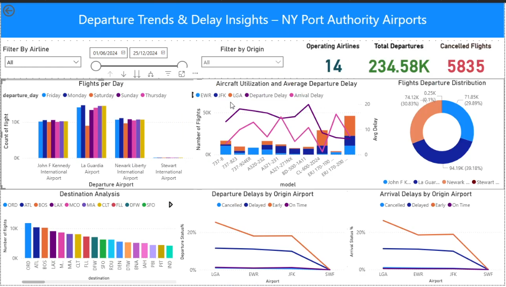

# ✈️ New York Airport Flights Dashboard

> **Author:** Zuhthi Sahan  
> **Tools Used:** Power BI, DAX, Power Query  
> **Data Source:** BTS (Bureau of Transportation Statistics)

## 📌 Overview

This project is an interactive **Power BI dashboard** designed for the **Port Authority** to monitor and analyze **departure delays**, **flight cancellations**, and **aircraft usage** across the **5 major airports in the New York area**. It provides data-driven insights using 6 months of real-world flight data from 2024.

---

## 🎥 Demo Video

📺 [Click here to watch the dashboard walkthrough](extra/2025-07-10 11-39-50.mp4)  

---
